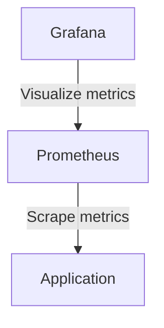

# Observability Cookbook for Applications

When operationg large and complex application under heavy load, it is important to have insights into the application
behavior. This is where observability comes into play. Observability is the ability to understand the internal state of a system
based on the external outputs. The three main pillars of observability are

* Logging
* Metrics
* Tracing

## Logging

For optimal analytics and monitoring it is crucial to have structured logging in place. 
Structured logging involves formatting log messages in a consistent manner, typically using key-value pairs or JSON format. 
This allows for easier parsing and querying of log data. My examples are in Go programming language, but the concepts can be applied to any language.
Go offers the 'log/slog' package for structured logging. Here is an example of how to use it:

```go
// Initialize slog with JSON handler and write to standard output
logger := slog.New(slog.NewJSONHandler(os.Stdout, &slog.HandlerOptions{
    AddSource: true,
}))
```

Then we can use the logger to log messages with structured data:

```go
slog.Info("User logged in", "userID", 12345, "method", "OAuth")
slog.Error("Failed to process payment", "orderID", 67890, "error", err)
```

This produces output like:

```json
{"level":"info","msg":"User logged in","userID":12345,"method":"OAuth","source":"main.go:10"}
{"level":"error","msg":"Failed to process payment","orderID":67890,"error":"payment declined","source":"main.go:15"}
```

Structured logs can be easily queried and analyzed using log management tools like ELK Stack (Elasticsearch, Logstash, Kibana) or Grafana Loki.

## Metrics

Metrics provide quantitative data about the performance and health of an application. Common metrics include request latency, error rates, and resource utilization.
Traditionally, Prometheus has been the go-to solution for metrics collection and monitoring. However, OpenTelemetry is emerging as a more versatile alternative that supports not only metrics but also tracing and logging.

### Prometheus Metrics

In the Prometheus ecosystem a service exposes an HTTP endpoint (usually `/metrics`) that Prometheus scrapes at regular intervals. Here is an example of how to set up a simple HTTP server in Go that exposes Prometheus metrics:

```go
package main

import (
	"net/http"

	"github.com/prometheus/client_golang/prometheus/promhttp"
)

func main() {

	http.HandleFunc("/", func(w http.ResponseWriter, r *http.Request) {
		w.WriteHeader(http.StatusOK)
		w.Write([]byte("Hello, World!"))
	})

	http.Handle("/metrics", promhttp.Handler())

	http.ListenAndServe(":8080", nil)
}
```

This is a very basic exmple, but it shows how to expose metrics for Prometheus to scrape. Next to our "business logic" at / which returns just a "Hello, World!",
we also expose the /metrics endpoint that Prometheus can scrape. We use the `promhttp.Handler()` to handle the metrics endpoint. It automaticallly collects default Go runtime metrics like memory usage and goroutine count.
Additional metrics can be created and registered using the Prometheus client library. The output now looks like this:

```
# HELP go_gc_duration_seconds A summary of the wall-time pause (stop-the-world) duration in garbage collection cycles.
# TYPE go_gc_duration_seconds summary
go_gc_duration_seconds{quantile="0"} 0
go_gc_duration_seconds{quantile="0.25"} 0
go_gc_duration_seconds{quantile="0.5"} 0
go_gc_duration_seconds{quantile="0.75"} 0
go_gc_duration_seconds{quantile="1"} 0
go_gc_duration_seconds_sum 0
go_gc_duration_seconds_count 0
# HELP go_gc_gogc_percent Heap size target percentage configured by the user, otherwise 100. This value is set by the GOGC environment variable, and the runtime/debug.SetGCPercent function. Sourced from /gc/gogc:percent.
...
```

> [!NOTE]
> The output is truncated for brevity.

Those metrics are in the Prometheus format and can be scraped by a Prometheus server. In a Kuberntes environment, a ServiceMonitor resource can be created to instruct Prometheus to scrape the metrics endpoint of the application.



### OpenTelemetry Metrics

OpenTelemetry provides a unified way to collect metrics, traces, and logs. Here is an example of how to set up OpenTelemetry metrics in a Go application:

```go
package main

import (
    "context"
    "log"
    "net/http"

    "go.opentelemetry.io/otel"
    "go.opentelemetry.io/otel/exporters/metric/prometheus"
    "go.opentelemetry.io/otel/metric/global"
    "go.opentelemetry.io/otel/sdk/metric"
)

func main() {
    // Create Prometheus exporter
    exporter, err := prometheus.New()
    if err != nil {
        log.Fatalf("failed to initialize prometheus exporter: %v", err)
    }

    // Create MeterProvider with the exporter
    meterProvider := metric.NewMeterProvider(
        metric.WithReader(exporter),
    )
    global.SetMeterProvider(meterProvider)

    // Create a meter
    meter := global.Meter("example-meter")

    // Create a counter metric
    requestCounter, err := meter.Int64Counter("http_requests_total")
    if err != nil {
        log.Fatalf("failed to create counter: %v", err)
    }

    // HTTP handler
    http.HandleFunc("/", func(w http.ResponseWriter, r *http.Request) {
        requestCounter.Add(context.Background(), 1)
        w.WriteHeader(http.StatusOK)
        w.Write([]byte("Hello, World!"))
    })

    // Expose metrics endpoint
    http.Handle("/metrics", exporter)

    log.Println("Starting server on :8080")
    http.ListenAndServe(":8080", nil)
}
```

## Tracing

Tracing provides insights into the flow of requests through a distributed system. It helps identify bottlenecks and latency issues by tracking requests as they propagate through various services.

```mermaid
gantt
    title Tracing Flow
    dateFormat  HH:mm:ss
    section Frontend
    User_click            :a1, 00:00:00, 00:00:01
    Call_Service B        :a2, after a1, 00:00:03
    section Shopping Cart
    Receive Request       :b1, after a2, 00:00:02
    Process Data          :b2, after b1, 00:00:04
    section Currency Conversion
    Convert               :a3, after a2, 00:00:01
```



Here is an example of how to set up OpenTelemetry tracing in a Go application:

