## Overview

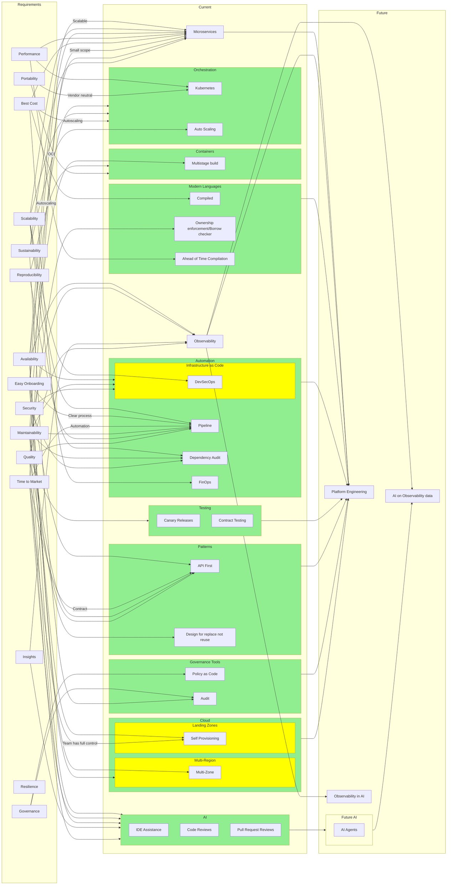

## Microservices

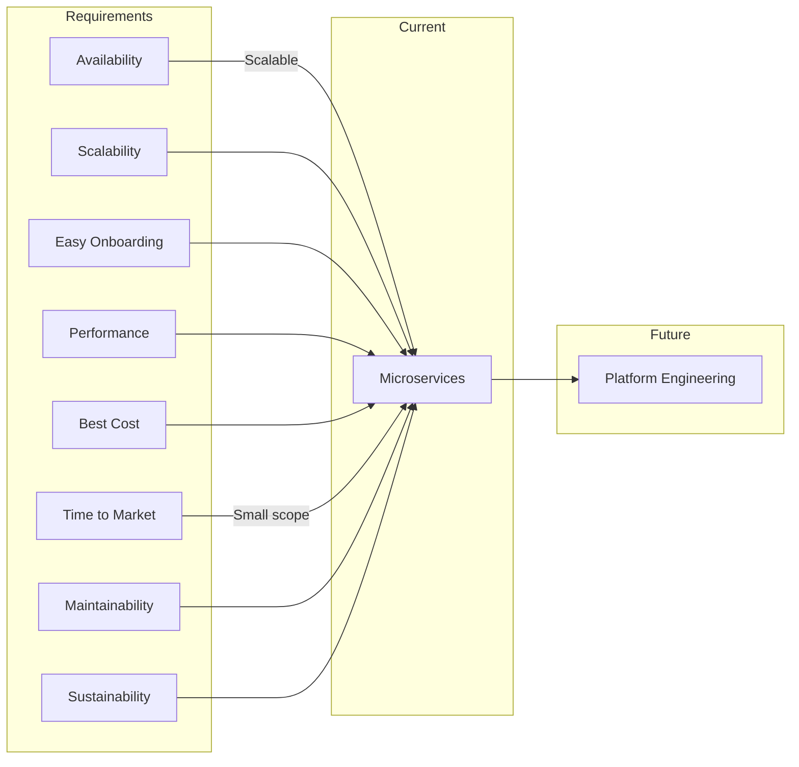

* Microservices architecture breaks down applications into smaller, independent services that can be developed, deployed, and scaled individually.
* This approach enhances availability and scalability, as services can be scaled based on demand.
* The smaller scope of microservices allows for faster development cycles, improving time to market.
* Microservices also promote maintainability by isolating changes to specific services, reducing the risk of impacting the entire application.
* Sustainability is improved through efficient resource usage, as services can be scaled independently based on their specific needs.
* Microservices can lead to cost savings by optimizing resource allocation and reducing over-provisioning.

## Modern Languages

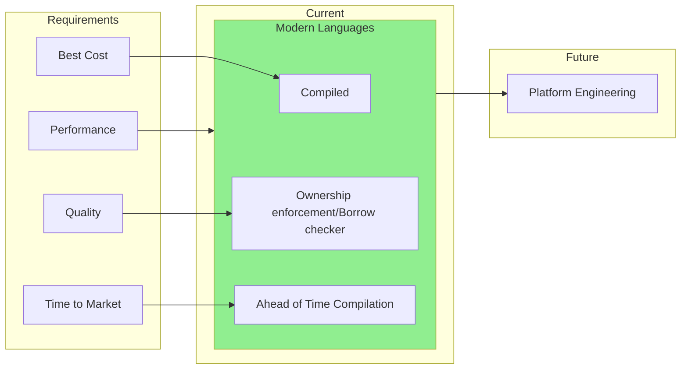

* Modern programming languages that are compiled (e.g., Rust, Go) offer performance benefits and lower runtime costs compared to interpreted languages.
* Ownership enforcement and borrow checking (as seen in Rust) help catch memory safety issues at compile time, improving code quality and reducing runtime errors.
* Ahead-of-Time (AOT) compilation can reduce startup times and improve performance, which is particularly beneficial for serverless and microservices architectures.
* Modern languages often come with robust ecosystems and tooling that can accelerate development and time to market.

## Containers

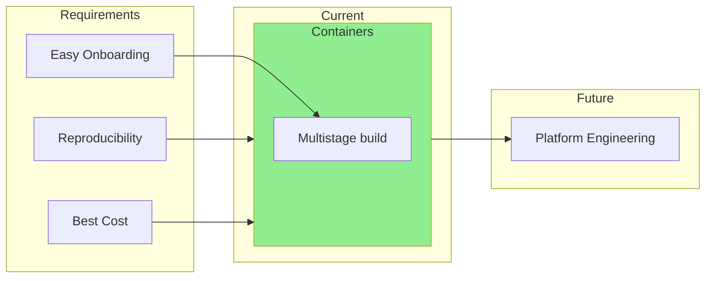

* Containers package applications and their dependencies into a standardized unit for software development, ensuring consistency across different environments.
* Multistage builds optimize container images by reducing their size and improving build efficiency, leading to cost savings in storage and bandwidth.
* Multistage builds also simplify the onboarding process by providing a clear and efficient way to build and deploy applications.

## Orchestration

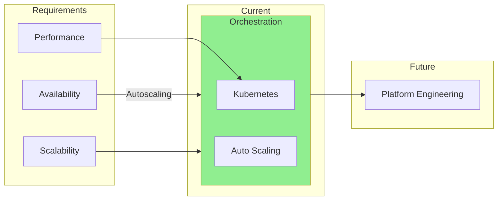

* **Orchestration** platforms like Kubernetes manage the deployment, scaling, and operation of containerized applications.
* **Auto Scaling** automatically adjusts the number of running instances based on demand, improving availability and cost efficiency.

## Automation

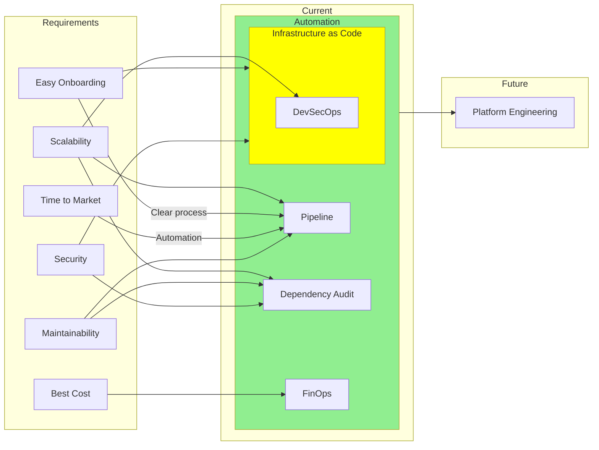

* Infrastructure is created and managed using code and automation tools to ensure consistency, repeatability, and version control.
* DevSecOps integrates security practices into the DevOps process, ensuring that security is considered at every stage of the software development lifecycle.
* Dependency audits help identify and mitigate vulnerabilities in third-party libraries and packages used in the software.
* FinOps focuses on optimizing cloud costs and resource usage to achieve the best cost efficiency.

## Patterns

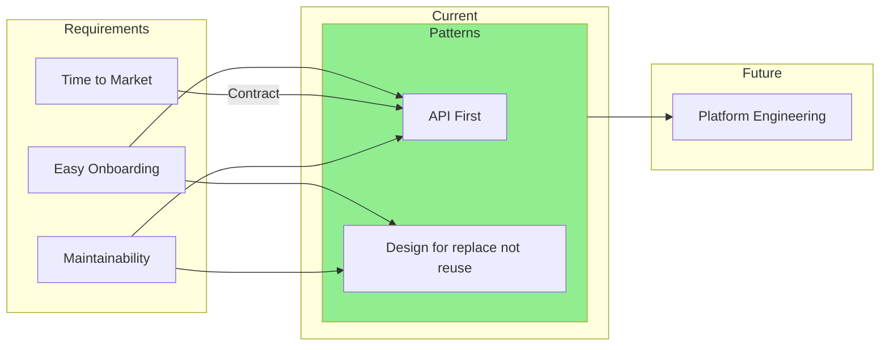

* API should be defined first (e.g. Protobuf, OpenAPI, GraphQL schema) before implementation to ensure clear contracts between services.
* Design services to be replaceable rather than reusable to facilitate easier updates and technology changes in the future.

## AI

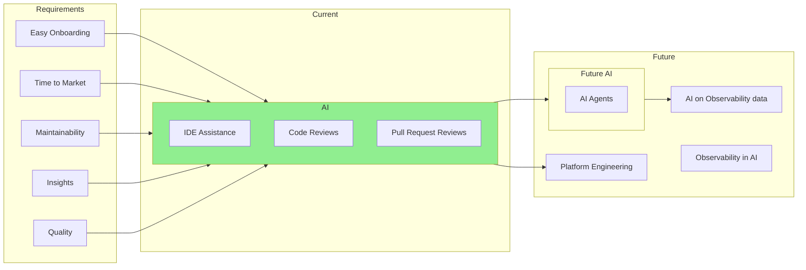

* AI-powered tools assist developers with code completion, reviews, and pull request analysis, improving productivity and code quality.
* Future AI agents could further automate development tasks, enhancing onboarding, time to market, maintainability, insights, and quality.
* AI can also be leveraged to analyze observability data for deeper insights and improved system performance.
* Observability can be integrated into AI systems to enhance their monitoring and reliability.

## Observability

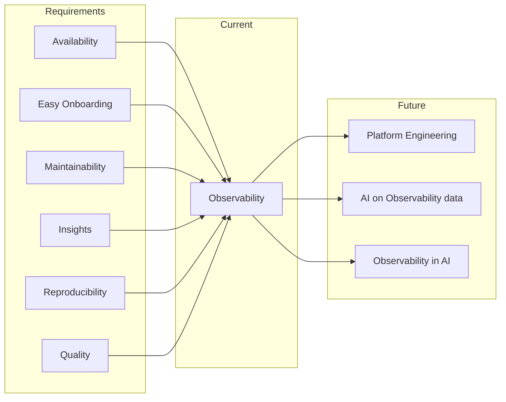

* Observability provides insights into the health and performance of applications through metrics, logs, and traces.
* It enhances availability by enabling proactive monitoring and alerting for potential issues.
* Observability data aids in maintainability by facilitating debugging and root cause analysis.
* It provides insights into system behavior, helping teams make informed decisions.
* Observability supports reproducibility by capturing the state of the system during incidents.
* It contributes to quality by enabling continuous improvement based on observed performance and user experience.
* Observability data can be leveraged by AI to derive deeper insights and automate responses to incidents.

## Cloud

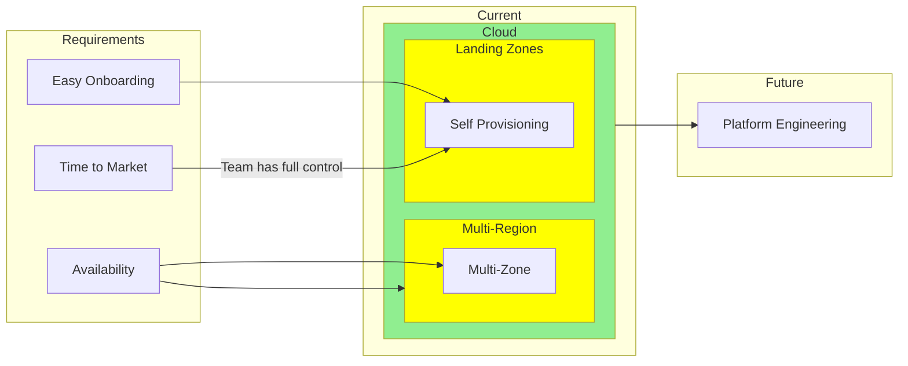

* Cloud providers offer multiple regions and each region contains multiple availability zones (AZs). Deploying applications across multiple AZs within a region enhances availability by mitigating the impact of an AZ failure.
* Multi-region deployments further improve availability by protecting against region-wide outages, ensuring that applications remain accessible even if an entire region goes down.
* Self-provisioning landing zones allow teams to quickly set up their cloud environments without waiting for centralized IT, speeding up onboarding and time to market.
* Having control over their own landing zones enables teams to deploy and manage resources more efficiently, reducing dependencies and delays.
* Cloud infrastructure provides the scalability and flexibility needed to support modern applications, allowing teams to adapt quickly to changing requirements.
* Cloud providers often offer built-in tools and services that can enhance observability, security, and cost management, further supporting the overall platform engineering efforts.
* Cloud-native services can help optimize resource usage, contributing to sustainability goals by reducing waste and improving efficiency.
* Utilizing cloud services can lead to cost savings through pay-as-you-go pricing models and the ability to scale resources based on demand.
* Cloud providers often have robust security measures in place, helping to ensure compliance with industry standards and regulations.
* Cloud platforms typically offer a wide range of services and tools that can accelerate development and deployment processes, improving time to market.
* Cloud environments can be designed to be portable, allowing applications to be moved between different cloud providers or on-premises environments as needed.
* Cloud providers frequently update their services and infrastructure, ensuring that teams have access to the latest technologies and features without the need for manual upgrades.
* Cloud platforms often provide extensive documentation, training resources, and community support, making it easier for teams to learn and adopt new technologies.
* Cloud providers typically offer robust disaster recovery and backup solutions, enhancing the resilience of applications and data.
* Cloud environments can be designed to support compliance with various regulatory requirements, helping organizations meet their legal obligations.
* Cloud providers often have global networks of data centers, enabling low-latency access to applications and services for users around the world.
* Cloud platforms can facilitate collaboration among distributed teams by providing shared access to resources and tools.
* Cloud providers often offer advanced analytics and machine learning services that can enhance application capabilities and provide deeper insights into user behavior and system performance.
* Cloud environments can be designed to support hybrid and multi-cloud strategies, providing flexibility and reducing vendor lock-in.
* Cloud providers frequently invest in sustainability initiatives, such as using renewable energy and optimizing data center efficiency, helping organizations reduce their environmental impact.
* Cloud platforms often provide tools for monitoring and managing costs, enabling teams to optimize their spending and improve financial accountability.
* Cloud providers typically offer robust identity and access management solutions, enhancing the security of applications and data.
* Cloud environments can be designed to support continuous integration and continuous deployment (CI/CD) practices, streamlining development workflows and improving software quality.
* Cloud providers often have extensive partner ecosystems, offering a wide range of third-party tools and services that can enhance application capabilities and support various use cases.

## Governance Tools

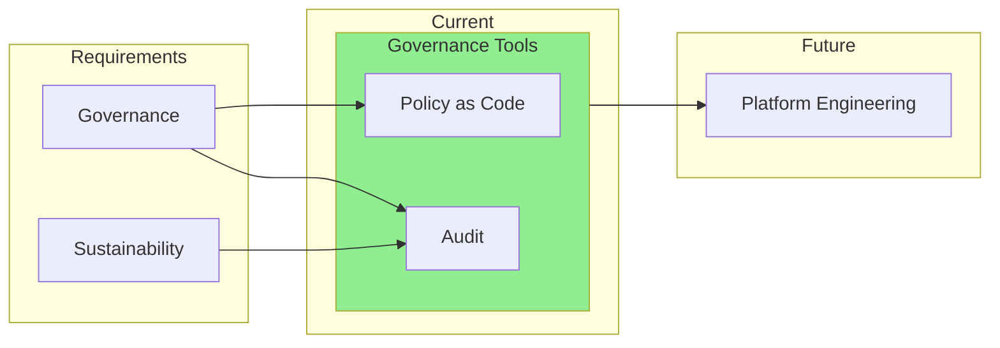

* Governance tools help enforce policies and conduct audits to ensure compliance with organizational standards and regulations.
* Sustainability initiatives can be supported through auditing resource usage and promoting efficient practices.

## Testing

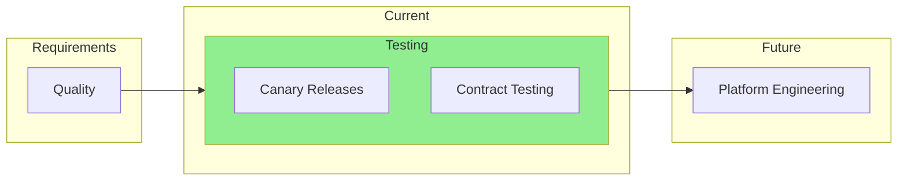

* Testing strategies like canary releases and contract testing help ensure software quality by validating changes in controlled environments before full deployment.
* Canary releases allow teams to deploy new features to a small subset of users, monitoring for issues before rolling out to the entire user base.
* Contract testing verifies that services adhere to defined API contracts, reducing integration issues and improving reliability.
* These testing practices contribute to overall software quality by catching issues early and ensuring that services work as expected.
* Implementing robust testing strategies enhances confidence in deployments, leading to more stable and reliable applications.
