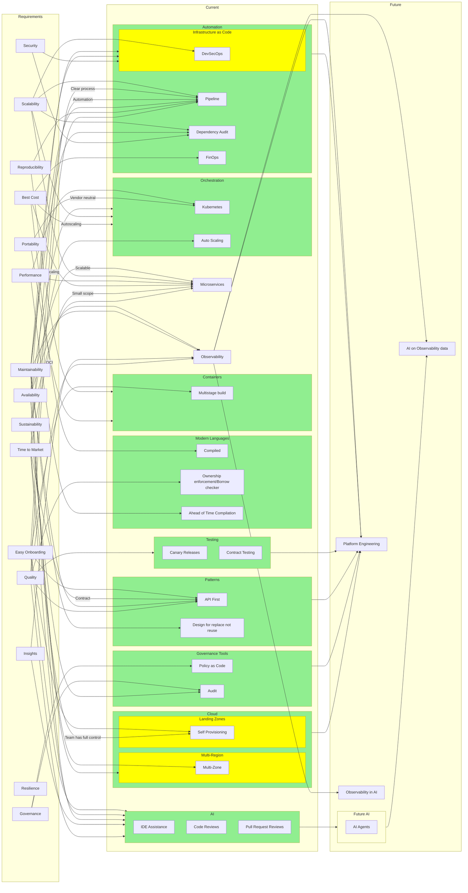

## Overview

```mermaid
graph LR
    style MOD fill:lightgreen
    style CO fill:lightgreen
    style ORC fill:lightgreen
    style AUT fill:lightgreen
    style IAC fill:yellow
    style TEST fill:lightgreen
    style PAT fill:lightgreen
    style GOVTOOLS fill:lightgreen
    style CLO fill:lightgreen
    style MR fill:yellow
    style LZ fill:yellow
    style AI fill:lightgreen
    subgraph REQ[Requirements]
      A[Availability]
      P[Performance]
      S[Scalability]
      EO[Easy Onboarding]
      I[Insights]
      TTM[Time to Market]
      REP[Reproducibility]
      Q[Quality]
      BC[Best Cost]
      SEC[Security]
      PORT[Portability]
      M[Maintainability]
      GOV[Governance]
      RE[Resilience]
      SUS[Sustainability]
    end
    
    subgraph CNT[Current]
      MS[Microservices]
      subgraph MOD[Modern Languages]
          CL[Compiled]
          MP[Ownership enforcement/Borrow checker]
          AOT[Ahead of Time Compilation]
      end
      subgraph AUT[Automation]
          CICD[Pipeline]
          subgraph IAC[Infrastructure as Code]
            DSO[DevSecOps]
          end
          DEP[Dependency Audit]
          FIN[FinOps]
      end
      subgraph CO[Containers]
        MUL[Multistage build]
      end
      subgraph ORC[Orchestration]
        K8s[Kubernetes]
        AS[Auto Scaling]
      end
      subgraph PAT[Patterns]
          APIF[API First]
          DFR[Design for replace not reuse]
      end
      subgraph AI[AI]
        IDE[IDE Assistance]
        CR[Code Reviews]
        PR[Pull Request Reviews]
      end
      OBS[Observability]
      subgraph CLO[Cloud]
        subgraph MR[Multi-Region]
          MZ[Multi-Zone]
        end
        subgraph LZ[Landing Zones]
          SP[Self Provisioning]
        end
      end
      subgraph GOVTOOLS[Governance Tools]
          PAC[Policy as Code]
          AUD[Audit]
      end
      subgraph TEST[Testing]
        CAN[Canary Releases]
        CON[Contract Testing]
      end
    end
    
    subgraph FUT[Future]
      PF[Platform Engineering]
      subgraph FAI[Future AI]
        AIA[AI Agents]
      end
      AIONBS[AI on Observability data]
      OBSAI[Observability in AI]
    end
    
    A -->|Autoscaling| ORC
    A -->|Scalable|MS
    A --> IAC
    A --> OBS
    A --> MR
    A --> MZ

    S --> MS
    S --> ORC
    S --> CICD
    S --> DEP
    S --> DSO
    
    EO -->|Clear process| CICD
    EO --> SP
    EO --> APIF
    EO --> AI
    EO --> MUL 

    P --> MS
    P --> K8s
    P --> AOT
    
    BC --> MS
    BC -->|Autoscaling| ORC
    BC --> CL
    BC --> FIN
    
    TTM -->|Automation| CICD
    TTM -->|Small scope|MS
    TTM --> AI
    TTM -->|Team has full control| SP
    TTM -->|Contract| APIF

    M --> DEP
    M --> APIF
    M --> DFR
    M --> OBS
    M --> CICD
    M --> AI
    M --> IAC

    I --> OBS
    I --> AI
    
    REP --> CICD
    REP --> CO
    
    Q --> OBS
    Q --> CICD
    Q --> AI
    Q --> APIF
    Q --> MP
    Q --> TEST
    
    SEC --> DEP
    SEC --> IAC
    
    PORT -->|OCI| CO
    PORT -->|Vendor neutral| K8s
    
    AI --> FAI
    OBS --> AIONBS
    FAI --> AIONBS
    OBS --> OBSAI
    
    GOV --> PAC
    GOV --> AUD
    
    SUS --> MS
    SUS --> AS
    SUS --> AUD

    AUT --> PF
    TEST --> PF
    PAT --> PF
    GOVTOOLS --> PF
    CLO --> PF
    OBS --> PF
```

## Microservices

