## Overview

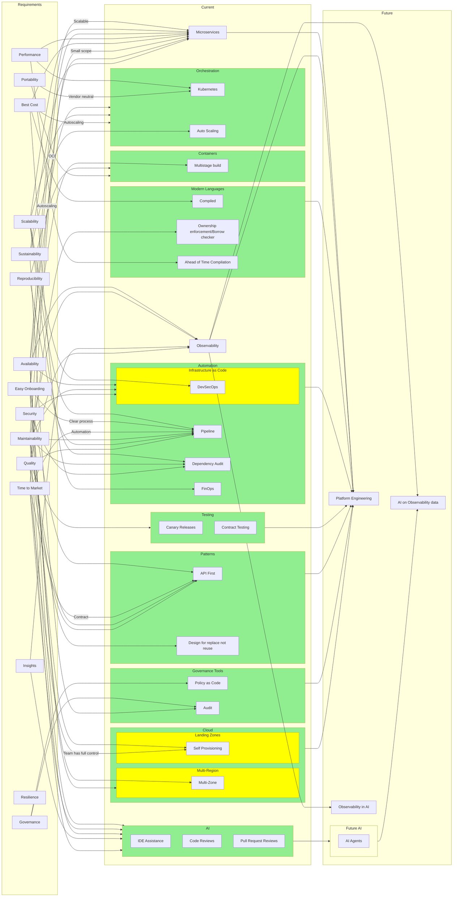

## Microservices

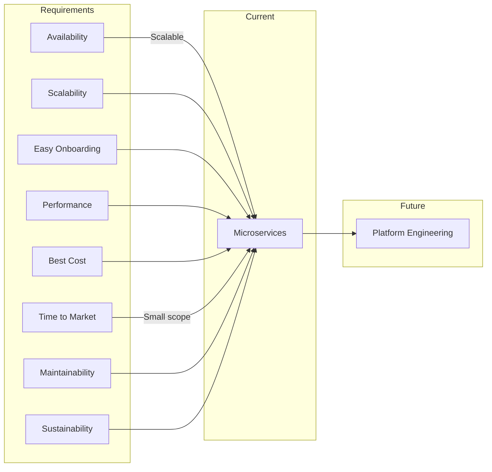

## Modern Languages

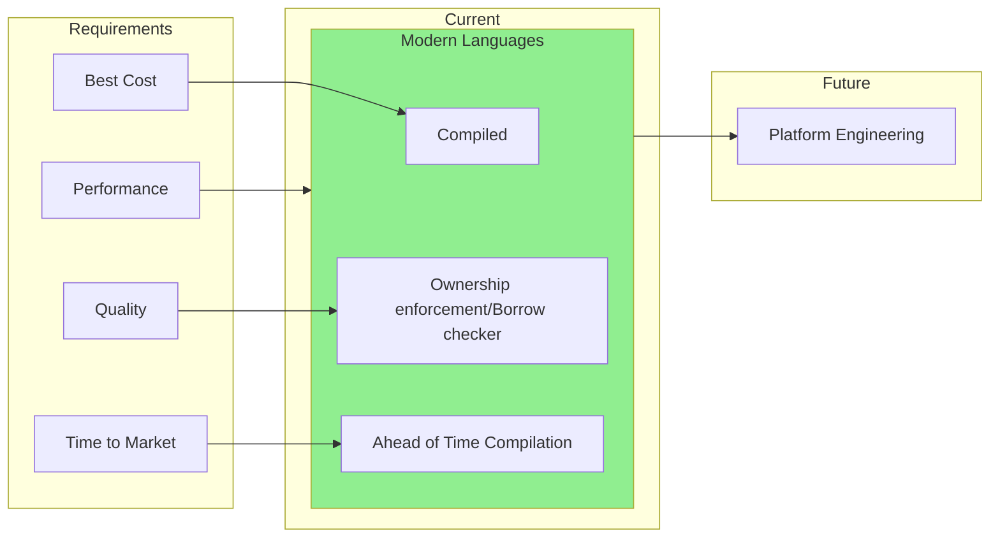

## Containers

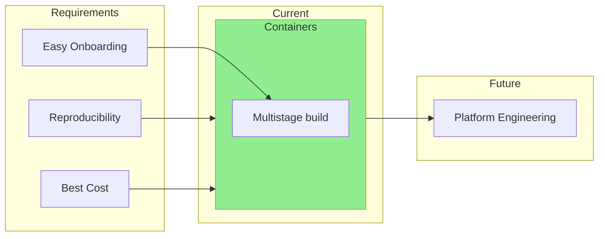

## Orchestration

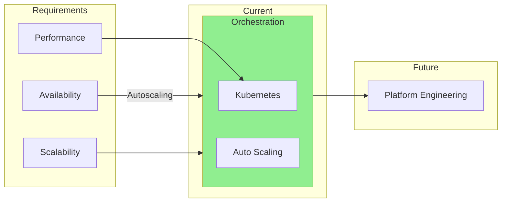

## Automation

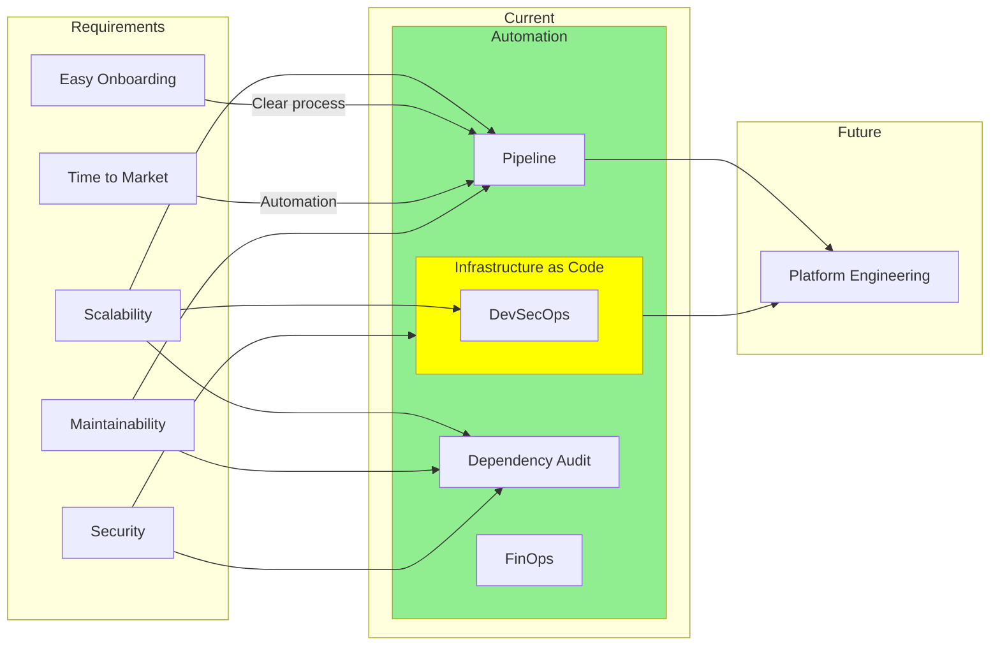
## Patterns

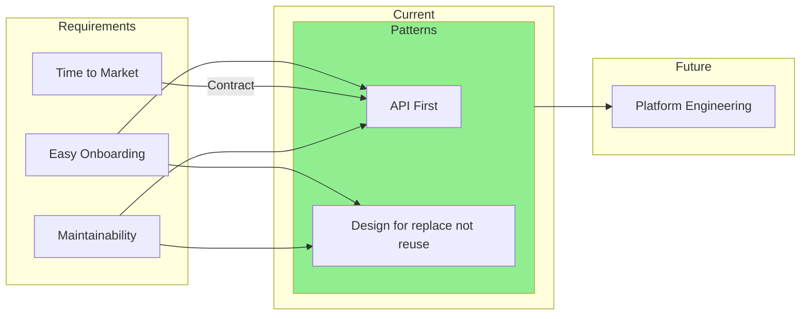

## AI

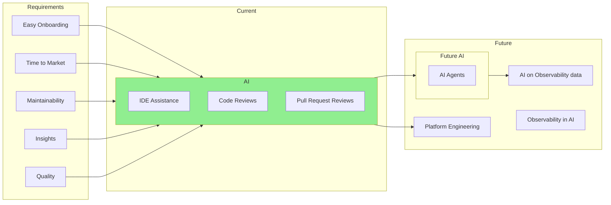

## Observability

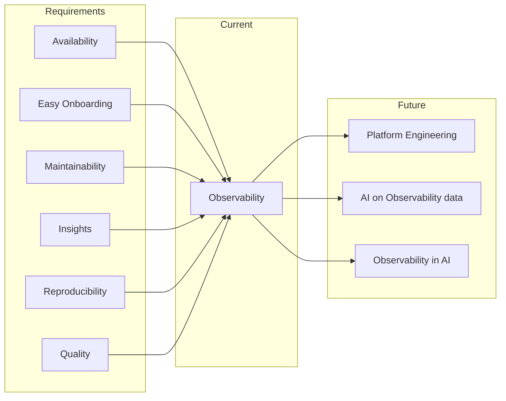

## Cloud

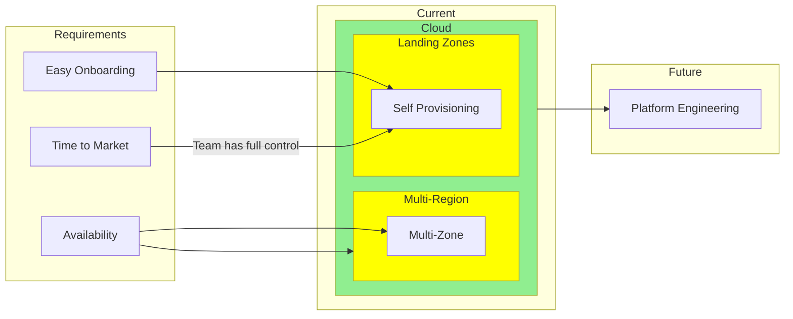

## Governance Tools

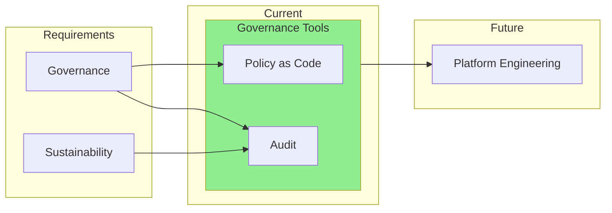

## Testing

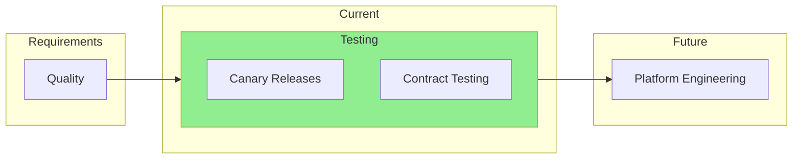

